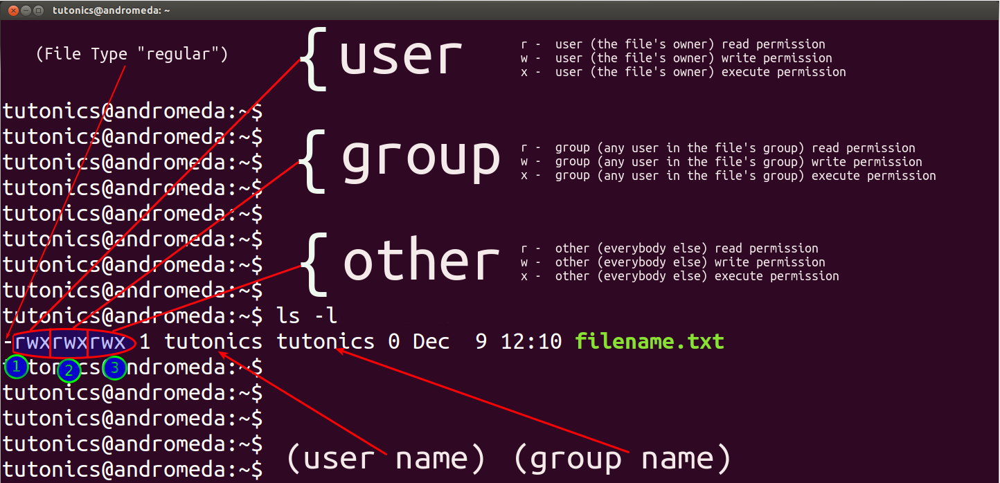

# Table of content

- [File system tree](#file-system-tree)
- [No File Extension](#no-file-extension)
- [Option and Arguments](#option-and-arguments)
- [Long format List](#long-format-list)
- [Linux System Directory](#linux-system-directory)
- [Wildcard](#wildcard)
- [Softlinks / Symbolic links](#softlinks-/-symbolic-links)
- [Hardlinks](#hardlinks)

## File system tree

Sama seperti windows, sistem operasi unix-like juga memiliki sebuah structur file sistem. Dalam unix-like ujung dari hirarki / folder pertama daris sistem dinamakan root yang di lambangkan dengan / . Jadi seluruh file dan folder yang ada pasti memiliki posisi berada di bawah root.

Tidak seperti windows yang setiap partisi yang kita miliki pasti memiliki urutan file sistemnya sendiri, unix-like dalam hal ini linux pasti hanya akan memiliki 1 buah file sistem untuk berapa banyakpun pastisi yang dimiliki. Jadi setiap ada sebuah pastisi baru maka secara otomatis akan di mount kedalam file sistem linux dan di tempatkan sesuai dengan lokasi yang telah di setting oleh system administrator.

## No File Extension

Dalam linux tidak seperti windows atau beberapa os lainnya yang mengharuskan sebauh file memiliki sebuah extension. Dalam linux kita dapat membuat sebuah file tidak memiliki extension, jadi kita dapat membuat file tersebut menggunakan hampir semua karakter yang adadalam keyboard pada umumnya.

Linux dalam hal file extension memiliki cara yang berbeda untuk mendeteksi sebuah file, jadi sebuah file tetap dapat dikenali oleh sistem tanpa harus mengandalkan extension yang mengikutinya.

Misalkan ada sebuah file dengan pdf extension asli .pdf, tetapi extension pada file tersebut di ganti menjadi .exe. Dalam hal ini linux secara otomatis tetap akan mendeteksi file tersebut sebagai pdf dan ketika kita membuka file tersebut tetap akan di bawa ke program yang di gunakan untuk membuka file pdf.

## Option and Arguments

Hampir setiap commad yang ada di linux pasti menggunakan structur seperti ini **commad option arguments**. Option adalah konfigurasi tambahan yang dapat kita aktifkan sesuai dengan list yang di berikan. Sedangkan arguments adalah target dari commad tersebut, tetapi tidak semua commad memerlukan sebuah argument.

Option dalam penggunaannya pasti diawali dengan tanda dash (-). Option sendiri di bagi menjadi 2 yaitu short option dan long option. Short option adalah option yang biasanya hanya menggunakan 1 huruf saja dan menggunakan 1 dash. Long option adalah option yang menggunakan nama yang panjang dan dalam penggunaanya pasti menggunakan 2 dash.

**Contoh**
Option | Long Option | Deskripsi
--- | --- | ---
**-x** | **--xsreve** | mengurutkan berdasarkan tanggal
**-y** | **--ylid** | menampilkan seluruhnya kecuali ..

**Sort Commad**

commad -x argument (mengurutkan berdasarkan tanggal)

commad -xy argument (mengurutkan berdasarkan tanggal dan tidak menampilkan ..)

**Long Commad**

commad --xsreve argument (mengurutkan berdasarkan tanggal)

commad --xserve --ylid argument (mengurutkan berdasarkan tanggal dan tidak menampilkan ..)

**Short and Long**

commad -x --ylid argument (mengurutkan berdasarkan tanggal dan tidak menampilkan ..)

## Long format List

Jika menjalankan commad list dengan menambahkan option -l, maka kita akan mendapatkan sebuah structur tampilan seperti ini

-rw-rw-r-- 1 computer computer  640 Nov  5 20:35 cd.md

-rw-rw-r-- 1 computer computer  123 Nov  6 21:16 commad-list.md

-rw-rw-r-- 1 computer computer 2812 Nov  8 21:12 hal-hal penting.md

-rw-rw-r-- 1 computer computer 1259 Nov  7 21:34 ls.md

-rw-rw-r-- | 1 | computer | computer | 1259 | Nov  7 21:34 | ls.md
--- | --- | --- | --- | --- | --- | ---
Aksess ke file tersebut | jumlah hard links | username dari pembuat file |  nama grup dari pembuat file | ukuran file dalam bytes | waktu trakhir file di modif | nama file

## Linux System Directory

Sama seperti windows yang memiliki beberapa directory sistem yang masing masing memiliki fungsi dan kegunaan tersendiri, seperti Program Files yang berisi seluruh program windows jika tidak kita rubah lokasi instalasinya.Linux juga memiliki folder sistem yang memiliki tugas masing masing.

**Linux System Directory**

Directory Nme | Deskripsi
--- | ---
**/** | Awal dari seluruh directory yang ada, biasa sisebut sebagai root
**/bin** | berisi seluruh binary program yang akan di jalankan sistem 
**/boot** | berisi linux kernel, initial RAM disk image dan boot loader.
**/dev** | berisi berbagai file untuk device yang sedang di gunakan atau terhubung.
**/etc** | berisi seluruh konfigurasi sistem. Selain itu juga berisi shell script yang akan berjalan pada saat boot.
**/home** | berisi seluruh directory dengan nama masing masing user untuk membedakan data data setiap user yang ada.
**/lib** | berisi seluruh shared library yang digunakan oleh program dari core sistem
**/lost+found** | berisi seluruh file recovery dari file sistem jika terjadi masalah. Seluruh device yang menggunakan linux format seperti ext3 pasti memiliki folder ini.
**/media** | berisi mount point dari sebuah removeble media di sebagian besar linux moderen
**/mnt** | berisi mount point dari sesuatu yang kita mount secara manual
**/opt** | berisi file file program yang kita install secara optional, biasanya berisi commersial software.
**/proc** | berisi virtual file system yang merupakan gambaran bagaimana linux karnel melihat komputermu
**/root** | berisi home directory untuk root user
**/sbin** | berisi program system binary yang merupakan program vital dalam sistem
**/tmp** | berisi temporary files yang di gunakan oleh program.
**/usr** | berisi berbagai program dan support file yang di gunakan oleh regular user
**/usr/bin** | berisi program binary yang terinstall sesuai dengan linux distribution yang di gunakan
**/usr/lib** | berisi shared library yang digunakan oleh program dari /usr/bin
**/usr/local** | berisi program yang di compile dari source code 
**/usr/share** | berisi shared library yang diperlukan oleh program dalam /user/bin
**/user/share/doc** | berisi file dokumentasi dari beberapa program yang di install
**/var** | berisi kumpulan database program selama program tersebut di gunakan / berjalan
**/var/log** | berisi log dari aktifitas system yang terjadi. Diantaranya yang terpenting adalah /var/log/syslog

**Interesting file on /boot**
  - /boot/grup/grup.conf atau menu.lst (untuk konfigurasi boot loader)
  - boot/vmlinuz atau yang mirip (linux kernel)

**Interesting file on /etc**
  - /etc/crontab (mendefinisikan pekerjaan yang secara otomatis akan berjalan)
  - /etc/fstab (konfigurasi storage device dan juga mount point dari device tersebut)
  - /etc/passwd (list dari user yang ada)

## Wildcard

Wildcard dalam dunia pemrograman dapat di artikan sebagai sebuah regular expression. Wildcard digunakan untuk memilih character berdasarkan filter yang di berikan. Filter tersebut berupa simbol simbol yang memiliki artinya masing masing.

**Wildcards**

Wildcard | Meaning
--- | ---
**\*** | Memilih seluruh character yang ada.
**?** | memilih seluruh character yang memiliki panjang 1
**[character]** | Memilih seluruh character yang merupakan member dari set character
**[!character]** | Memilih seluruh character yang bukan member dari set character
**[[:class:]]** | Memilih seluruh character yang menjadi member dari class yang belih spesifik
**[0-5]** | Memilih seluruh character yang beada di antara angka 0 ~ 5
**[A-C]** | Memilih seluruh character uppercase yang berada di antara A ~ C
**[a-g]** | Memilih selurh character lowercase yang berada di antara a ~ g

**Character Class**

Character Class | Meaning
--- | ---
**[:alnum:]** | Memilih seluruh character baik tulisan atau angka
**[:alpha:]** | Memilih seluruh alphabetic character
**[:digit:]** | Memilih seluruh numeral
**[:lower:]** | Memilih seluruh kalimat yang seluruhnya menggunakan lowercase
**[:upper:]** | Memilih seluruh kalimat yang seluruhnya menggunakan uppercase

**Wildcards Example**

Pattern | Matches
--- | ---
**\*** | memilih seluruh files
**g*** | memilih selurh files yang di awali oleh huruf g
**b\*.txt** | memilih seluruh files yang di awali oleh huruf g dan di akhiri oleh .txt
**Data???** | memilih seluruh files yang di awali dengan Data dan di ikuti oleh 3 character lainnya
**[abc]*** | memilih seluruh files yang di awali oleh huruf a, b atau c
**BACKUP.[0-9][0-9][0-9]** | memilih seluruh files yang diawali oleh BACKUP dan di ikuti oleh 3 angka.
**[[:upper:]]*** | memilih seluruh files yang di awali oleh uppercase letter
**[![:digit:]]*** | memilih seluruh files yang tidak di awali oleh angka
***[[:lower:]123]** | memilih seluruh files yang di akhiri oleh huruf kecil atau angka 1, 2, atau 3.

## Softlinks / Symbolic links

Sebuah softlinks adalah file yang akan mengacu pada file lainnya. Dalam windows softlink dapat di artikan sebagai sebuah shortcut dari sebuah file. Karena memiliki fungsi sebagai shortcut maka sebuah softlinks tidak dapat di jalankan apabila file yang di jadikan acuan / tujuan di hapus.

## Hardlinks

